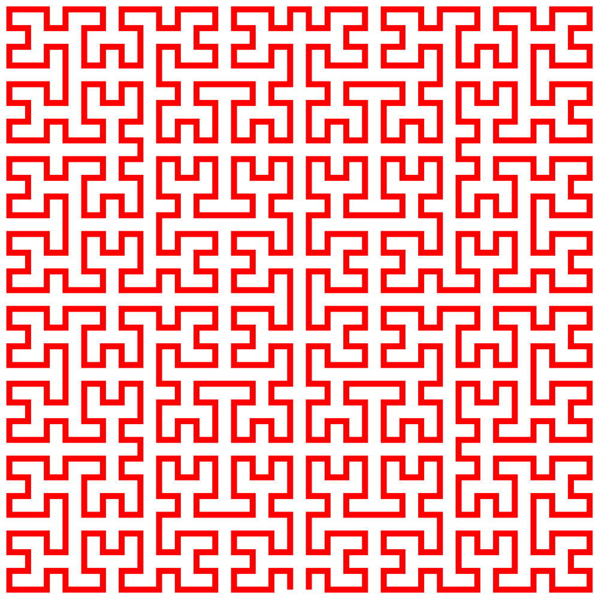

# SVG Fractals

[](https://www.python.org/)
[](https://docs.astral.sh/uv/)
[](https://www.w3.org/Graphics/SVG/)
[](LICENSE)

Generate SVG artwork from classic space-filling fractals. The command-line app can create a chosen pattern with custom colors, or generate a random pattern using weighted color and pattern data.



## Patterns

- Hilbert curve
- Gosper curve
- Moore curve
- Peano curve

## Requirements

- Python 3.14 or newer
- `DATA.xlsx` in the repository root for weighted color and pattern data
- Dependencies listed in `pyproject.toml`

## Installation

Using uv:

```powershell
uv sync
```

## Usage

Run the interactive generator:

```powershell
uv run python main.py
```

Or, if you installed with pip:

```powershell
python main.py
```

The script prompts for an output file name and whether to generate a random pattern. Generated SVG files are written to the `svgs/` directory.

## Project Structure

```text
fractals/
  fractal_funcs.py  Fractal drawing entry points
  utils.py          L-system and geometry helpers
svgs/
  example.svg       Example generated output
main.py             Interactive CLI
DATA.xlsx           Weighted color and pattern data
```

## License

This project is licensed under the MIT License. See [LICENSE](LICENSE) for details.
